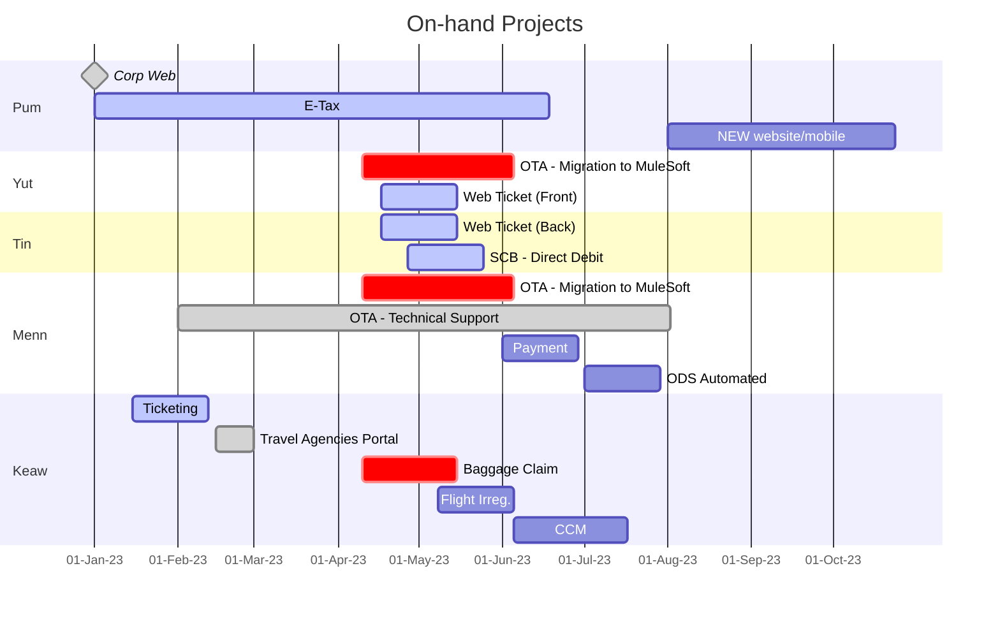
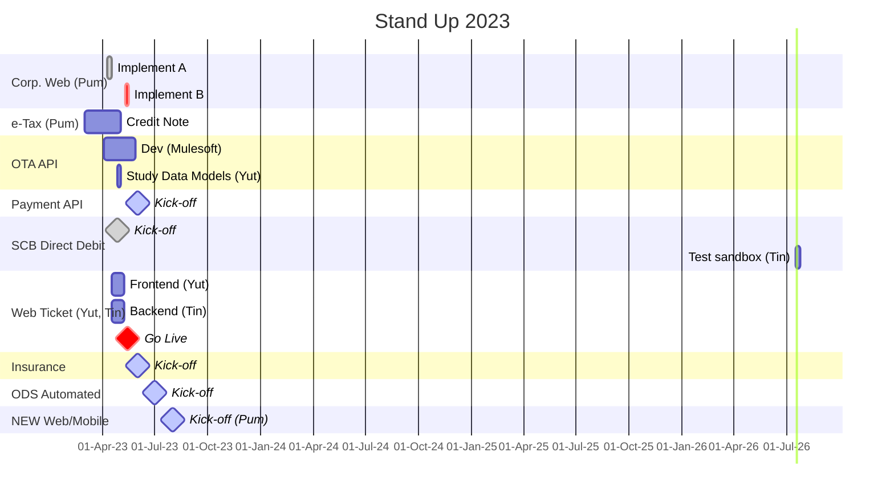
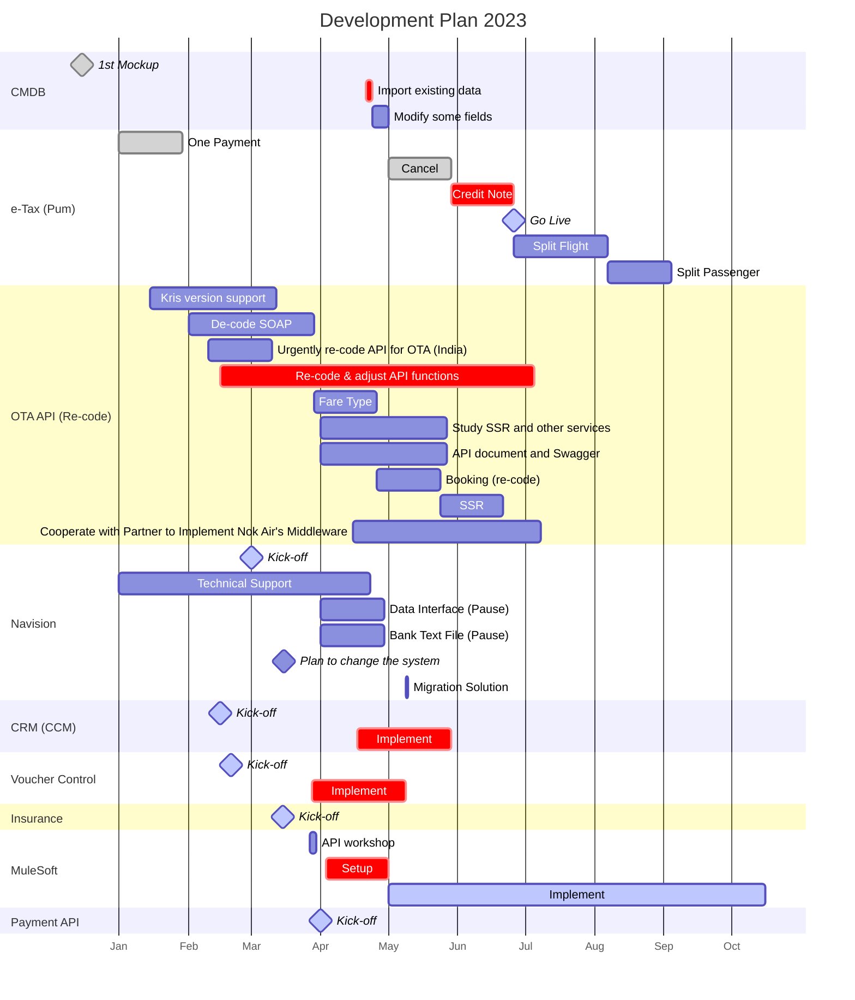

# Apps

## Road Map

### On-hand Project

### Stand Up

### Currently

### Links
1. [CCM](https://hackmd.io/t-Ilc3ssSCmkTCgQ_Iy8ew#Timeline)
1. [E-Tax](https://dev.azure.com/NokDevOps/e-Tax/_wiki/wikis/e-Tax.wiki/200/Timeline)
1. [MuleSoft](https://dev.azure.com/NokDevOps/MuleSoft/_wiki/wikis/MuleSoft.wiki/166/Timeline)
1. [Payment](https://dev.azure.com/NokDevOps/Nok%20Pay2/_wiki/wikis/Nok-Pay2.wiki/73/QR-Payment)
1. [Ticketing](https://hackmd.io/bman_puCTu2z9DhZNIjT6w?view)