# Blueprint

:::info
:information_source: [Apps](https://hackmd.io/pePD1kwgRfyckzzAPIBRxw#Apps)
:::

# Universe

## Infra Layer

### AirFase
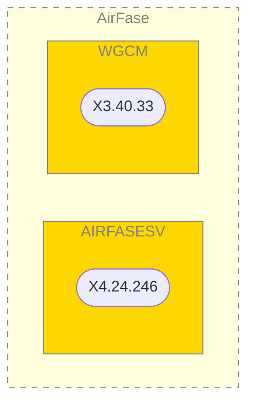

### Corp Web
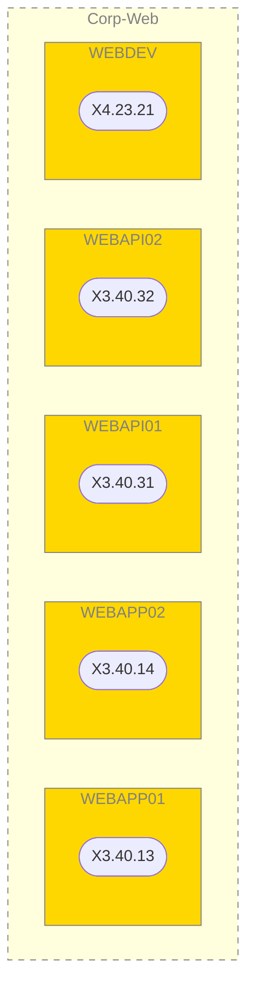

### Domain Controller
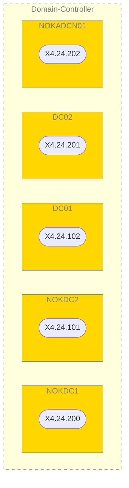

### File Sharing
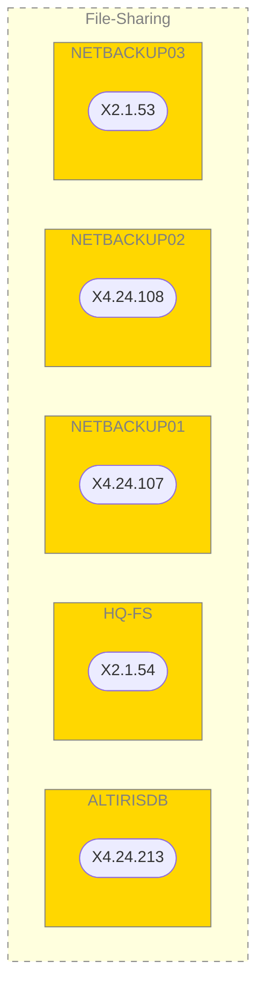

### HRIS
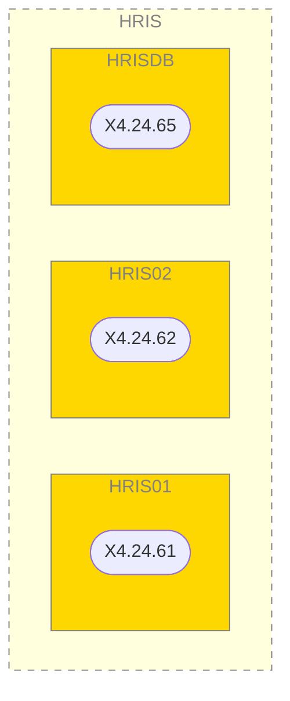

### Nok CRM
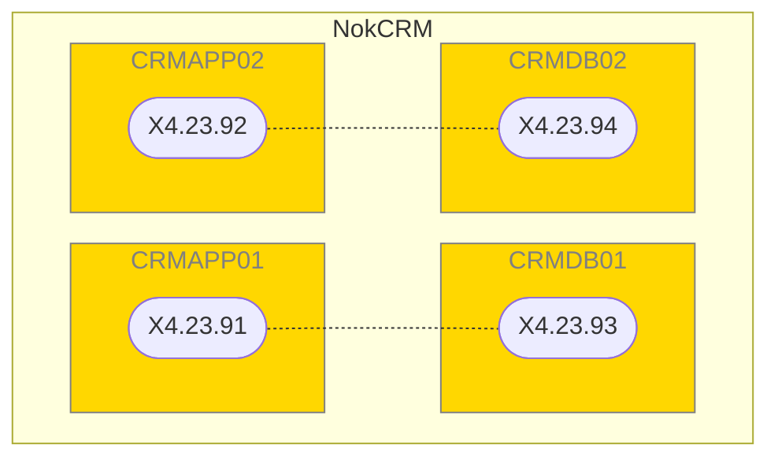

### Nok DD
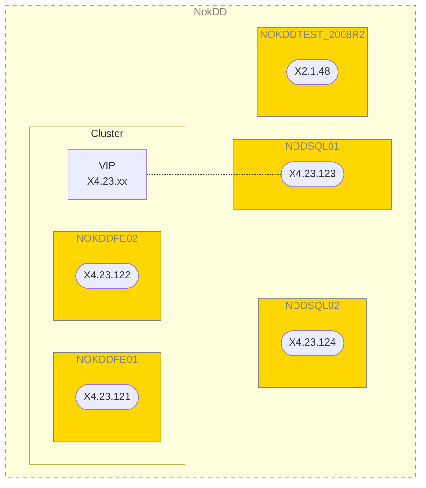

### Nok Fanclub
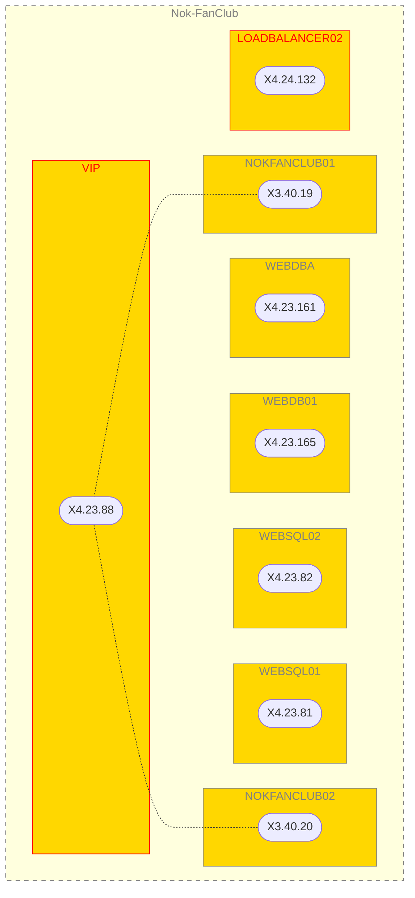

### Nok POS
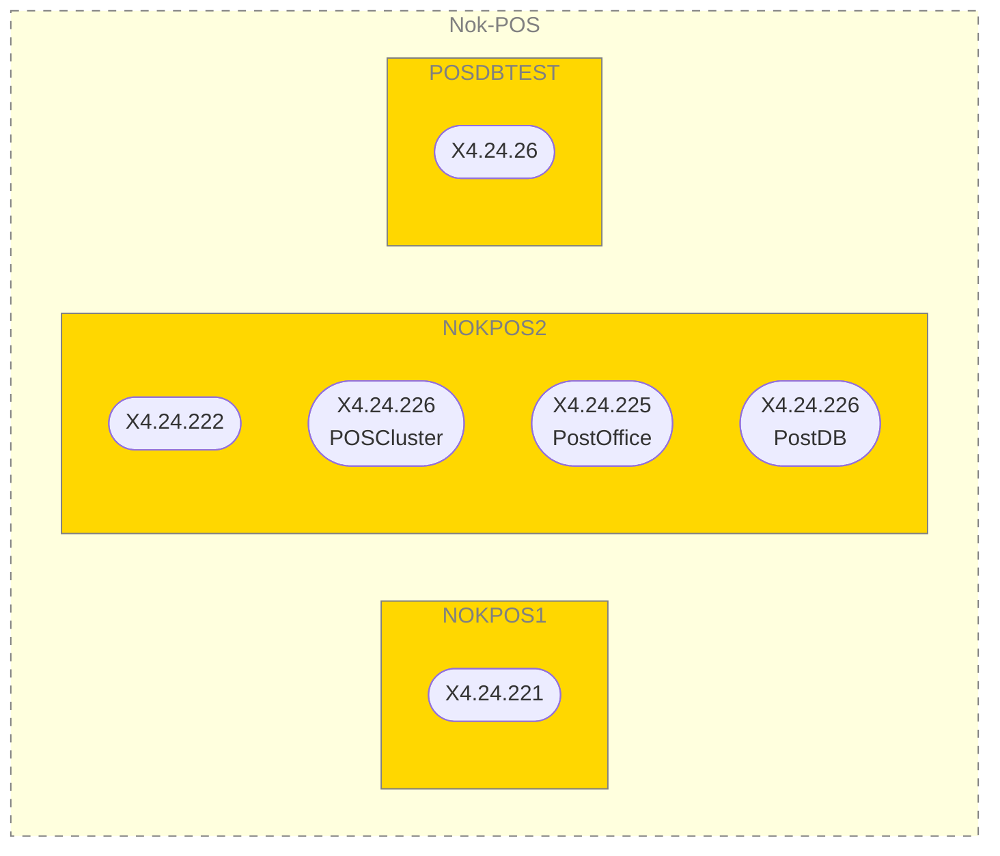

### NokSmart
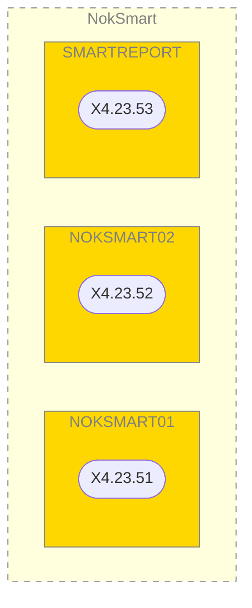

### IT UR
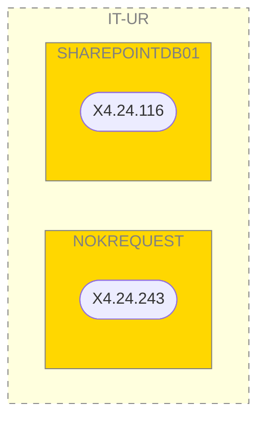

### iWork/iDoc
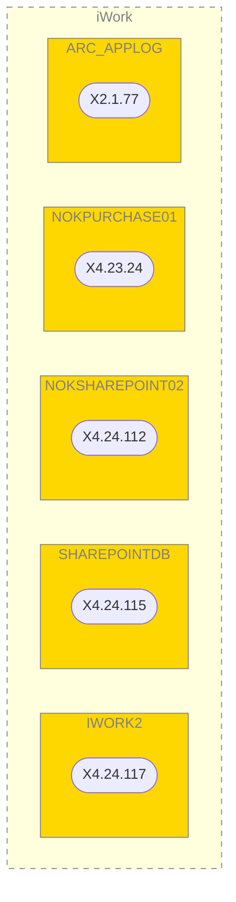

### Navision
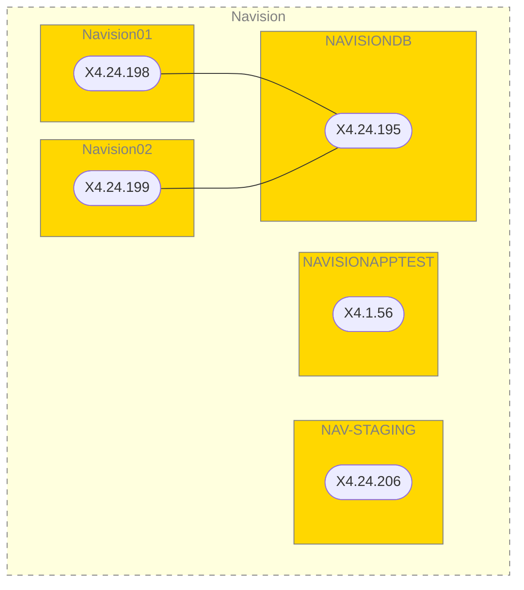

## Application Layer

### Corp Web
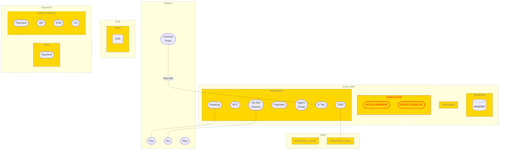

