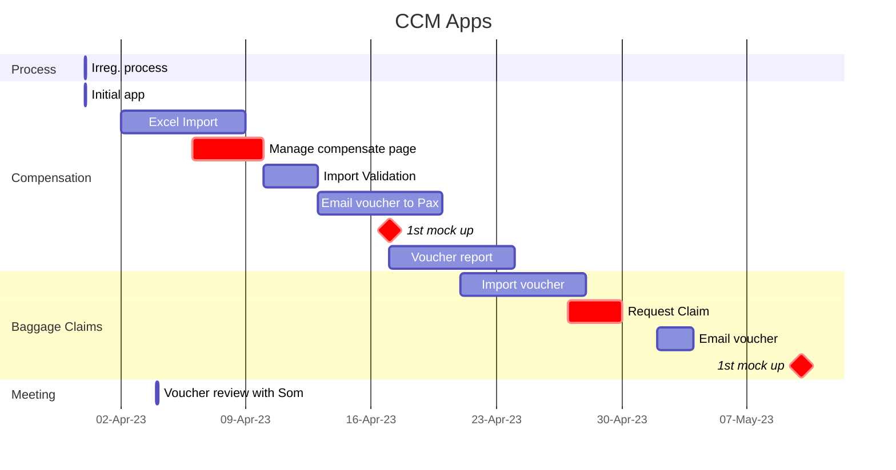
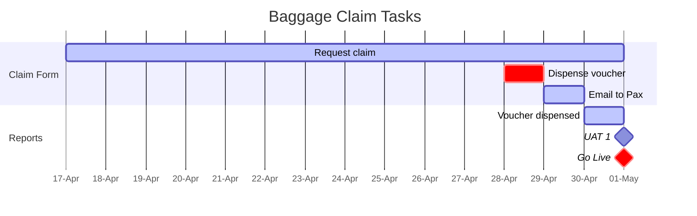
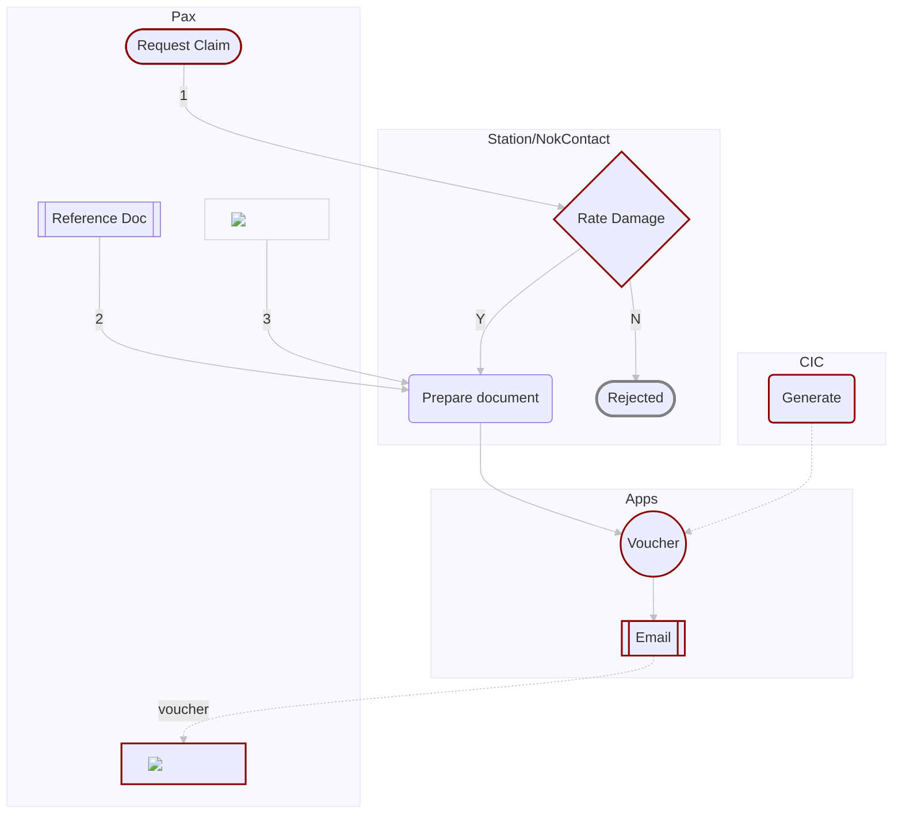
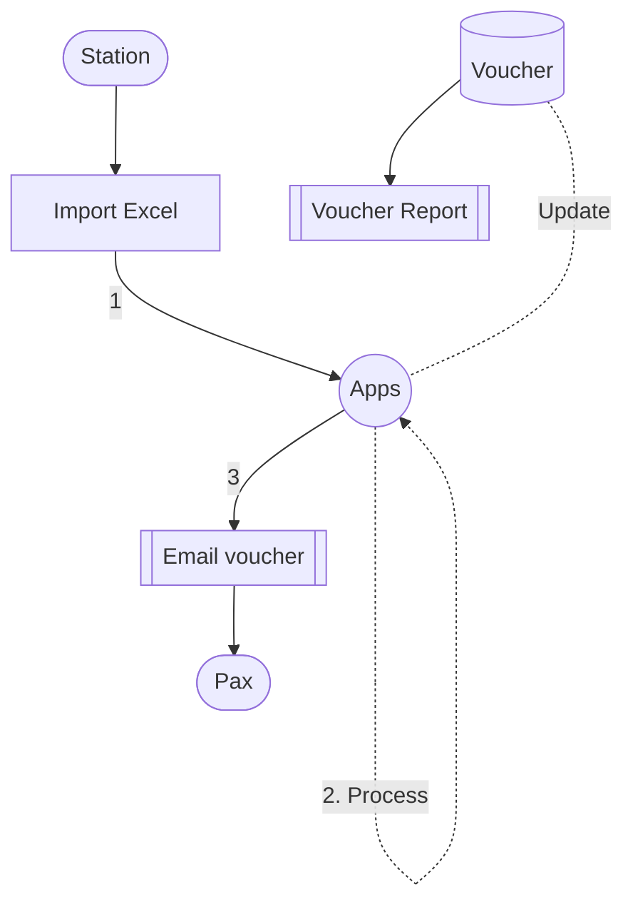
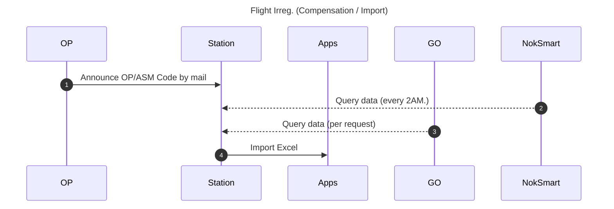
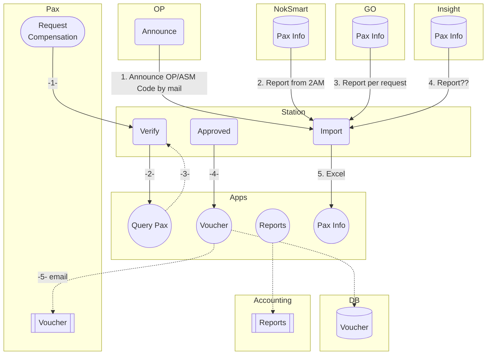

:::info
:information_source: [Apps](https://hackmd.io/pePD1kwgRfyckzzAPIBRxw#Apps)
:::

# CCM

[toc]

# Timeline

# Baggage Claims

## Overview

1. ผู้โดยสารทราบกระเป๋ามีปัญหา เช่น แตก หัก ชำรุด เป็นต้น (ที่สนามบินต้นทางหรือปลายทาง)
1. ผู้โดยสารติดต่อที่สนามบินปลายทาง
1. เจ้าหน้าที่ประเมินค่าเสียหาย โดยจ่ายเป็น Voucher มูลค่า 500 หรือ 1,000 บาท รวมมูลค่าไม่เกิน xxxx บาท
1. เจ้าหน้าที่ดำเนินการเตรียมเอกสารดังนี้
    - Passenger  Baggage Claim Form
    - Property Irregularity Report (PIR)
    - ใบรับเงิน
    - ถ่ายสำเนาบัตรประชาชน หรือ passport ผู้โดยสาร
1. เดิม จ่ายเป็นสด เปลี่ยนเป็น Voucher
    - โดยทาง CIC จะ generate Voucher มูลค่า 500 บาท และ 1,000 บาท อย่างละ 1,000 ใบ อายุ 1 ปีนับจากวันที่ gen voucher
    - ทางสถานีจัดเตรียมเอกสารตามข้อ 4
    - เปลี่ยนจากการเขียนเอกสารใบรับเงิน เป็นเจ้าหน้าที่กรอกรายละเอีดยลงในระบบ > เลือก Compensate 500บาท หรือ 1,000 บาท จำนวน x ใบ > ปริ้นเอกสารให้ผู้โดยสารเซ็นต์
        - หมายเหตุ สำหรับแบบฟอร์มใบรับเงินขอสอบถามหน่วยงานที่เกี่ยวข้องก่อนนะคะ
        
## Tasks

## Workflow

# Flight Irreg.

## Overview

## Compensation / Import

# ^C^ompensation

## ^R^equirement

### In case of flight irregularity

1. เมื่อมีประกาศ Flight IRR เจ้าหน้าที่ีที่ update flight status หรือเจ้าหน้าที่ที่เกี่ยวข้องสามารถดำเนินการดังนี้
- จัดส่ง SMS
- จัดส่ง E-mail
- เลือก Option การช่วยเหลือผู้โดยสารตามเงื่อนไข CAAT ได้แก่
   - เปลี่ยนแปลงเที่ยวบินฟรี 1  ครั้ง
   - เก็บเครดิต 100% ระยะเวลา xx เดือน > ระบบ generate และส่งอีเมลแจ้งผู้โดยสาร พร้อมเงื่อนไข
   - เปลี่ยนแปลงเส้นทาง
   - คืนเงิน

1. ระบบตรวจสอบว่าชำระเงินรูปแบบไหน
   - Cash ระบบให้กรอกเลขที่บัญชี ชื่อบัญชี ธนาคาร หากโอนให้บุคคลอื่น ให้แนบเอกสารได้
   - บัตรเครดิต
   - ซื้อผ่านตัวแทนจำหน่าย > ระบบแจ้งติดต่อผ่านตัวแทนฯ ภายใน 45 วันทำการ

1. เมื่อผู้โดยสารกรอกรายละเอียดเรียบร้อยส่งไปที่บัญชี
1. บัญชีดำเนินการคืนเงิน
1. การเงินส่งเรื่องให้ธนาคารเพื่อคืนเงินแต่ละช่องทาง
1. การเงิน update status การคืนเงิน
1. ระบบส่ง SMS/E-mail ให้ผู้โดยสารเมื่อคืนเงินเรียบร้อย
1. ระบบลงบันทึก
   ได้รับเงินชดเชย 600 บาท หรือ 1,200 บาท (ระบบสามารถเลือกได้)
   - เงินสด กรอกเลขที่บัญชี ชื่อบัญชี ธนาคาร หากโอนให้บุคคลอื่น ให้แนบเอกสารได้
   - เมื่อผู้โดยสารกรอกรายละเอียดเรียบร้อยส่งไปที่บัญชี
   - บัญชีดำเนินการคืนเงิน
   - การเงินส่งเรื่องให้ธนาคารเพื่อคืนเงินแต่ละช่องทาง
   - การเงิน update status การคืนเงิน
   - ระบบส่ง SMS/E-mail ให้ผู้โดยสารเมื่อคืนเงินเรียบร้อย
   - voucher ระบบ generate voucher ส่งให้ผู้โดยสารพร้อม T&C

1. ในหน้า website B2C / B2B
   - ผู้โดยสาร Log in เพื่อ Manage Booking
   - สามารถ เลือก Option ได้ตามเงื่อนไข ข้อ 1.3

1. เจ้าหน้าที่สามารถดึง report ดูได้ว่า ผู้โดยสารในเที่ยวบิน Flight IRR มีการเลือก Option หรือยังไม่ได้เลือก
1. Staff  สามารถเปลี่ยน option ได้เมื่อเลือกไปแล้ว (หลังบ้าน)

