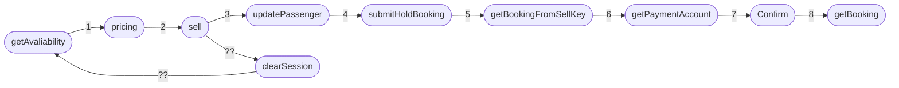

# OTA

[toc]

---

# Go Live Timeline

# Features
## Existing OTA API

## New OTA API

## _Booking Flow_
1. Initiate the "GetAvailability" API call to retrieve flight availability information.
1. Use the "Pricing" API to calculate the fare and journey details.
1. Submit a "Sell" API call to confirm the booking.
1. Update passenger information using the "UpdatePassenger" API call with the SellKey.
1. Hold the booking with the "SubmitHoldBooking" API call using the SellKey.

Is this booking flow correct or are there any necessary changes that need to be made?