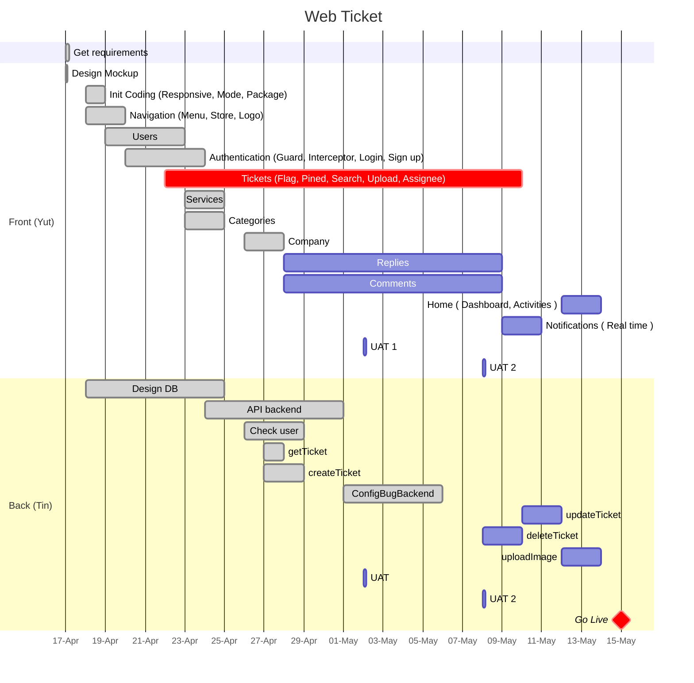

# Ticketing

:::info
:information_source: [Apps](https://hackmd.io/uhpwmOWLQgqIBC1NdnsQ5g?view)
:::

# Web Ticket

```mermaid
gantt
title Web Ticket

dateFormat YYYY-MM-DD
todayMarker stroke:#ADFF2F, opacity:0.7
%%axisFormat %Y-%b
%%axisFormat %a-%d
axisFormat %d-%b
%%tickInterval 1month


Get requirements: done, 2023-04-17, 4h 

section Front (Yut)
    Design Mockup: done, 2023-04-17,2h
    Init Coding (Responsive, Mode, Package): done, 2023-04-18,1d
    Navigation (Menu, Store, Logo): done, 2023-04-18,2d
    Users: done, 2023-04-19,4d
    Authentication (Guard, Interceptor, Login, Sign up): done, 2023-04-20,4d
    Tickets (Flag, Pined, Search, Upload, Assignee): crit, 2023-04-22, 18d
    Services : done, 2023-04-23,2d
    Categories: done, 2023-04-23,2d
    Company: done, 2023-04-26,2d
    Replies: 2023-04-28,11d
    Comments: 2023-04-28,11d
    Home ( Dashboard, Activities ): 2023-05-12,2d
    Notifications ( Real time ): 2023-05-09,2d 
    
    UAT 1: 2023-05-02, 4h
    UAT 2: 2023-05-08, 4h 
    
section Back (Tin)
    Design DB: done, 2023-04-18,1w 
    API backend: done, 2023-04-24, 1w
    Check user: done, 2023-04-26, 3d 
    getTicket: done, 2023-04-27,1d 
    createTicket: done, 2023-04-27,2d
    ConfigBugBackend: done, 2023-05-01,5d
    updateTicket: 2023-05-10,2d 
    deleteTicket: 2023-05-08,2d
    uploadImage: 2023-05-12,2d
    UAT: 2023-05-02, 4h
    UAT 2: 2023-05-08, 4h 

Go Live: crit, milestone, 2023-05-15, 0d

```